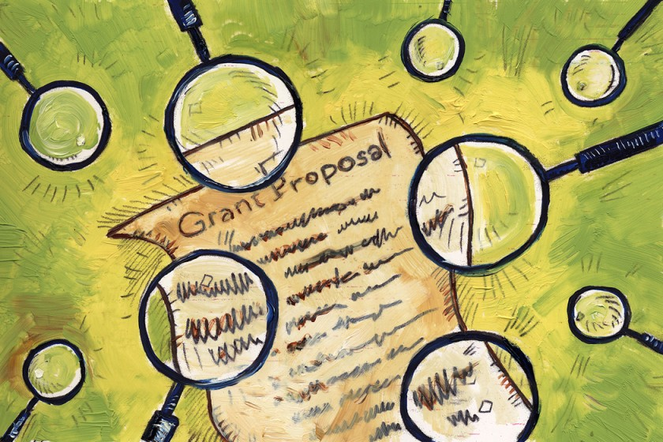
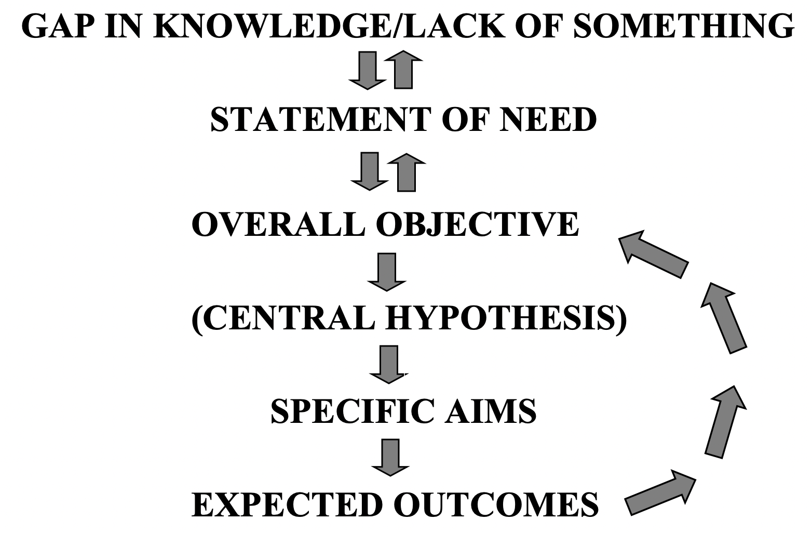

# Grant-writing
So you have to ask an organization for money for your research project? This might feel like a daunting task, but we'll walk you through it in this guide. *You got this!*

> Brian Taylor for [*The Chronicle*](https://www.chronicle.com/article/10-tips-for-successful-grant-writing/)

***

# Developing a hook
<link type="text/css" rel="stylesheet" href="css/main.css" />
This first step is *exploratory.* You have to let yourself be free! Don't overthink your answers, just jot things down. Yes, really jot! Grab a scrap paper and pen, or open a notepad on your computer, and make some notes to the following questions. You can do bullet points, word clouds, phrases, or compete sentences. Up to you! BE FREE!
> This short video about writing hooks is **not** specifically about grant proposals, but the principles apply. Check it out!


### Questions to answer
* What are you passionate about, in terms of research?

* What is the problem or need, and why is it important?

* What sources of kinds of data can you use to validate the importance of your proposed project?

* How is existing knowledge or practice inadequate?

* Why is your idea better?

* How is it new, unique, different?

* What will it contribute, and who will benefit from it (intellectual merit and broader impacts?

* What is the goal of your proposal (make sure you have a clear goal statement)?

* What is a specific, measureable objective for your proposal?

### Get inspired
> TED Talks are known for their attention-grabbing hooks! Here is a short compilation of some good ones. What features do these hooks have that you could use in your proposal?  


 

> What are some terms that describe great science?

#### Exercise
1. Read [The Grant Application Writer's Workbook: National Science Foundation - FastLane Version, Chapter 2: How to Develop and Optimize the Idea for your Grant Application.](http://www.grantcentral.com/workbooks/national-science-foundation/)
2. Complete the [*Developing a research idea* worksheet.](files/Developing_a_research_idea.pdf)
3. Brainstorm a few sentences to "hook" your reader's interest. 

***
# Constructing a flow of logic

**
LINEAR PROGRESSION OF LOGIC FOR A STRONG OVERVIEW & OBJECTIVES SECTION
**

*From The Grant Application Writer's Workbook: National Science Foundation - FastLane Version, Chapter 7 Online: Create a Bullet Outline for your Overview and Objectives Section.*

The body of your proposal should follow a logical path and address the following points, as described in *The Grant Application Writer's Workbook: National Science Foundation - FastLane Version, Part Two, Chapter 7 Online: Create a Bullet Outline for your Overview and Obectives Section,* freely available for download [here:](http://www.grantcentral.com/downloads-nsf/)

### Introductory paragraph
* Opening sentence
  * should be arresting; remember your hook!
  * relevant to the program you're applying to 
  * establish that it's an important topic (avoid truisms)

* Current knowledge
  * 2-3 sentences total
  * inform reviewers of current state of knowledge, but know your audience!
  * present oldest → newest
  * establish yourself as expert

* Gap in knowledge
  * point out that this next step is needed to advance the field 
  * establish that this is an important problem and it being unknown is blocking progress
  * must be simple, direct and must relate to the preceding current knowledge
  * all of the logic downstream will evolve from this gap

### “What, why, who” paragraph

* Long-term goal
  * continuum of research 

* Overall objective
  * what will be accomplished 
  * links back to gap in knowledge

* Central hypothesis
  * the hypothesis that must be tested to to attain your overall objective
  * set up presentaion of your specific aims
  * also include here any preliminary data that support the central hypothesis, if you have any
  
* Rationale
  * link back to gap, but put a positive spin on the "problem" statement. What happens if the gap is filled?
    * "once X is identified, Y can happen,” where Y is something of interest to your audience
  
### Specific aims
* lay out that you will test parts of your central hypothesis, *or*
* lay out tasks that will be undertaken to meet the need/fill the gap

### "Payoff" paragraph
* creativity, originality, and/or transformative potential
* expected outcomes
* positive impact on field

#### Exercise
1. Complete *The Grant Application Writer's Workbook: National Science Foundation - FastLane Version, Part Two, Chapter 7 Online: Create a Bulleted Outline for your Overview and Obectives Section,* downloadable from [here,](http://www.grantcentral.com/downloads-nsf/) to create a bulleted outline of your proposal.
2. Continue developing your "hook" and bulleted outline into a 1-2 paragraph description of your topic. This should encompass the gap through to central hypothesis as described above and in the suggested reading. Focus on the clarity of ideas rather than elegant text, and remember: Keep it Simple! 
3. Find a friend to review your hook or review your own using [this rubric.](files/Hook_rubric.pdf)

***
# Literature searching

Identifying the appropriate breadth and depth of a literature review, as well as where to find appropriate sources
> This short video lays out a nice introduction on how to write a literature review. Even if you've written literature reviews before, it might be worth it to review the basics to get you going on the right track. Plus, the video links to several other helpful videos on the topic. 


#### Exercise
Write a series of questions/sub-headings addressing each aspect of your central hypothesis. Perform a literature search, and identify the most influential papers that address that question/topic.  Write a short summary of each paper addressing the topic, method of analysis, conclusions, and how it relates to your question/topic. You should aim for a total of 15-20 papers max, so you will have to be selective about which are the KEY papers that your work is in conversation with. Aim to include a mix of classic and recent papers. Show this annotated bibliography to your mentor and PI to get suggestions for any papers you may have missed. 

***
# Developing a plan

* Introduction 
  * “This is the conceptual overview of the aim”
  * Want to hook the reader and explain why this aim is worthwhile
  * Give a brief summary 
  * Justification of approach
  * Think of overall outcome in Aim

* Research Design (How you will do it)
  * Arrange the Aims in a logical flow
  * Make sure the aims (especially their outcome) aren’t dependent on other aims to be successful 
  * Experimental design vs. methodology 
  * Won’t be detailed methods of equipment and reagents 
  * Replication
  * Randomization 
  * Controls (most important)
  * Positive vs negative
  * Limitations of technology 
  * Limitations of technique 
  * Look in the literature 
  * When writing your experimental design: How do you know what level of detail is appropriate (is it citable)
  * Citable 
  * Fits space 
  * Analysis framework 
  * Critical reagents difficult to retain 
  * Timeline
  * Sampling points

* Expected outcomes 
  * Show you understand what type of data
  * Potential problems/alternative approaches 
  * Demonstrate expertise and head off any reviewer concerns 
  * Will this be a common concern 
  * Alterative strategy 

* Use strong language:
  * hope , try ---> we will
  * Ask yourself is their sufficient detail in my hands … conceptional aspects of the aim 
highlight resources on campus that make you the ideal researcher

* Characteristics of a great hypothesis 
  * Testable
  * Falsifiable 
  * Can be clearly refuted 
  * General 
  * Also, generate new streams of ideas (is going to be interesting in 10 years)
  * Rooted in existing knowledge 
  * Thought about the alternative hypothesis 
  * Simple/straight forwarded

#### Exercise 
Fill out the Aims in the general format below: 
* Aim 1: Title
  * Introduction
  * Research Design
  * Expected Outcomes
  * Potential problem and alternate approaches

***
# Figures and displays
* Purposes of displays:
  * Give information in reduced space
  * Give information more clearly
  * Provide compelling preliminary data
  * Provide proof of feasibility
  * Stick in reviewer’s mind
  * Provide visual break for reviewer
  * Make proposal visually attractive
* Types of displays:
  * Conceptual – illustrate concept or hypothesis, pose predictions graphically
  * Summarize – present information in concise format
  * Data – present preliminary results
  * Experimental design – Explain experimental design/ methods
* Rules for better figures (from Rougier et al. 2014)
  * Know your audience
  * Identify your message
  * Adapt the figure to the support medium (i.e. consider size and complexity)
  * Captions are not optional
  * Use color effectively
  * Avoid “chartjunk”
  * Must be fully legible when printed in black and white (9 pt Arial font or above)
* Integrating displays into text
  * When do you want the reader to look at the display? Position as close as possible. 
  * Explicitly send them to look at the display. E.g. “As can be seen from Fig. 3, …”
Conclusions/ big picture stuff in text, tell reader what you want them to conclude from the display. Give details in display title or caption. 
Preliminary data - state why these data are important for specific aim. 
Components of figure legends 
Brief title for figure
Description of main point/result of figure
Methods required to interpret figure including sample sizes
Key for any symbols/abbreviations

***
# Scientific writing 

Based on Style: Lesson in Clarity and Grace by Joseph Williams  

Know what you want to say: as clearly and simply as possible 
#### Exercise
Undertanding causal factors … lead to more effective treatment 
Treatments that address excessive drinnking 
We could more effectively treat students who drink excessively if we underant why they do 
[subject] [verb] [object]
* Ten Principles for Writing Clearly
> Example 2:
Subject: The wolf’s jump (a walk through the woods)
Verb: occurred
Object: Little Red Riding Hood
Once upon a time, Little Red 
Nominalizations: when you turn a verb into a noun
You see this all the time in scientific writing 
> Example 3:
“The outsourcing of a high-tech work to Asia by corporation results in the loss of many jobs for American workers”
Nominalizations: “the outsourcing of”
“American workers lose jobs when high-tech jobs are outsourced to Asia”
Bad: The intention of the committee is to improve morale
Good: The committee intends to improve morale 
Think about characters
Noun strings:
Early childhood thought disorder misdiagnosis often result from
Physicians misdiagnose disorders in early childhood
Cohesion and coherence 

***
# Broader impacts


***
# Personal statements 

***
# Eye-catching titles
The tile of the proposal should be brief, scientiiccally valid, intelligible for the audience, and potentially suitable for use in a public format as often times awarded proposal titles are lsited on websites, for example. 

### Tip
Your title should emphasize the payoff---the *product* of the research. 

# Additional resources

***
# References
[Morrison, D. C., and Russell, S. W. 2012. The Grant Application Writer's Workbook: National Science Foundation - FastLane Version.](http://www.grantcentral.com/workbooks/national-science-foundation/)

# Copyright
All material preseneted is copyright protected and may not be shared, uploaded, or distributed. &copy; Caroline Williams 2020, unless otherwise noted. 

[GitHub Flavored Markdown](https://guides.github.com/features/mastering-markdown/).

